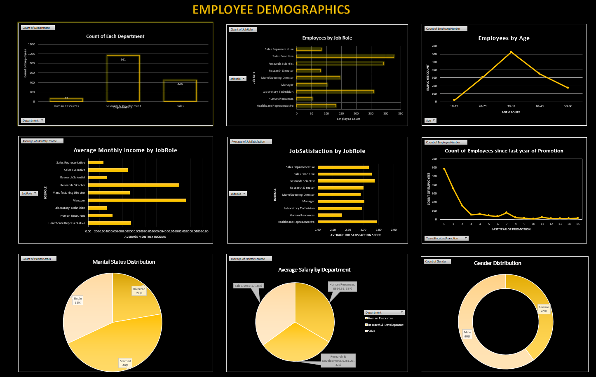
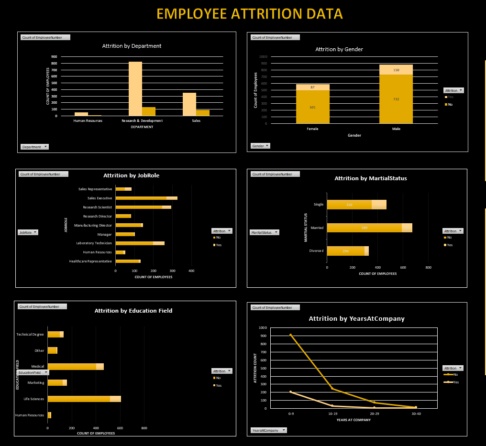
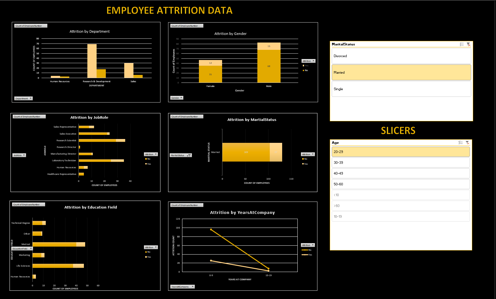
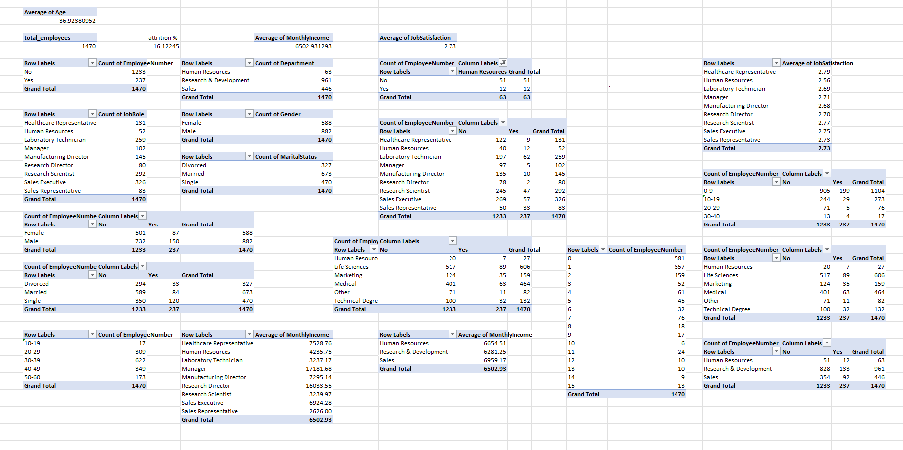
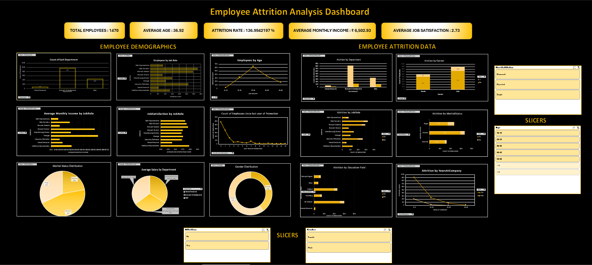

# Employee Attrition Analysis Dashboard

An interactive Employee Attrition Analysis Dashboard built using Microsoft Excel to analyze workforce demographics, employee satisfaction, salary trends, and attrition patterns.

This project leverages Pivot Tables, Pivot Charts, KPI Cards, and Slicers to transform raw employee data into meaningful business insights for HR analytics and decision-making.

---

# Project Overview

Employee attrition is a major challenge for organizations. This dashboard helps identify trends and factors influencing employee turnover through interactive visual analysis.

The dashboard provides insights into:

- Employee demographics
- Attrition trends
- Department-wise analysis
- Salary patterns
- Job satisfaction
- Employee tenure
- Education field distribution
- Gender and marital status analysis

---

# Tools & Technologies Used

- Microsoft Excel
- Pivot Tables
- Pivot Charts
- KPI Cards
- Slicers
- Data Cleaning
- Dashboard Design & Formatting

---

# Dataset Information

The dataset contains employee-related information such as:

- Employee Number
- Age
- Gender
- Department
- Job Role
- Monthly Income
- Marital Status
- Education Field
- Years at Company
- Job Satisfaction
- Attrition Status

---

# Dashboard KPIs

The dashboard includes the following key metrics:

| KPI | Value |
|------|------|
| Total Employees | 1470 |
| Average Age | 36.92 |
| Attrition Rate | 16.12% |
| Average Monthly Income | ₹ 6,502.93 |
| Average Job Satisfaction | 2.73 |

## KPI Cards Preview

<p align="center">
  
</p>

---

# Employee Demographics Dashboard

This section focuses on workforce composition and employee demographics.

### Key Visualizations

- Department-wise Employee Count
- Employees by Job Role
- Employees by Age Group
- Average Monthly Income by Job Role
- Job Satisfaction by Job Role
- Promotion Trends
- Marital Status Distribution
- Gender Distribution

## Employee Demographics Dashboard Preview

<p align="center">
  
</p>

---

# Employee Attrition Dashboard

This dashboard section analyzes employee attrition across different categories.

### Key Visualizations

- Attrition by Department
- Attrition by Gender
- Attrition by Job Role
- Attrition by Marital Status
- Attrition by Education Field
- Attrition by Years at Company

## Employee Attrition Dashboard Preview

<p align="center">
  
</p>

---

# Interactive Slicers

The dashboard includes slicers for dynamic filtering and interactive analysis.

### Available Filters

- Age Group
- Gender
- Marital Status
- Attrition Status

## Slicers Preview

<p align="center">
  
</p>

---

# Pivot Tables & Data Analysis

Pivot Tables were used to summarize and structure the raw employee data before building the dashboard visuals.

### Analysis Includes

- Employee Count
- Attrition Distribution
- Salary Analysis
- Job Satisfaction Metrics
- Department Analysis
- Gender Distribution
- Age Group Insights

## Pivot Tables Preview

<p align="center">
  
</p>

---

# Complete Dashboard Preview

<p align="center">
  
</p>

---

# Key Insights

- Research & Development has the highest number of employees.
- Attrition is highest among employees with fewer years at the company.
- Sales and Laboratory Technician roles show relatively higher attrition.
- Married employees represent the largest employee group.
- Job satisfaction scores are relatively balanced across job roles.

---

# Repository Structure

```bash
employee_attrition_analysis/
│
├── Employee-data-analysis.xlsx
├── KPI CARDS.png
├── Pivot_tables.png
├── employee_attrition_dashboard.png
├── Employee-demographics-charts.png
├── slicers.png
├── complete_dashboard.png
└── README.md
```

---

